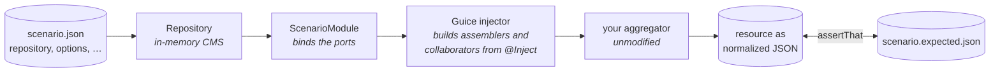

# IES Aggregator Testkit

A scenario harness for aggregators built on the [IES Aggregator API](https://github.com/sitepark/ies-aggregator).
It loads a JSON scenario as an in-memory CMS, wires the **real** assembler chain around it through
the ports of the API, runs an aggregation and compares the resulting resource with a golden file.

The production classes run unmodified. What the harness replaces are the ports the platform would
supply — the repository, the channel, the image scaler, the variant catalog — and it does so in a
way that is deliberately **not more generous** than production: an aggregation error fails the test
instead of being logged, the clock is frozen, the scaler is deterministic.



## Using it in a project

```xml
<dependency>
  <groupId>com.sitepark.ies</groupId>
  <artifactId>ies-aggregator-testkit</artifactId>
  <version>1.0.0-SNAPSHOT</version>
  <scope>test</scope>
</dependency>
```

The harness does not know what your resource looks like — which area holds the content, how the
root of the component tree is marked, which container a section is aggregated into. You tell it
once, with a `ScenarioLayout`, ideally built from the constants of your resource model so there is
nothing to keep in step:

```java
public final class MyScenario {

  static final ScenarioLayout LAYOUT =
      new ScenarioLayout(Resource.CONTENT, Resource.CONTENT_ROOT, "main", "main");

  static ScenarioContext load(String resource) {
    return ScenarioContext.load(resource, LAYOUT);
  }
}
```

A scenario test then reads like this — one method per section type, one file pair per case:

```java
static List<Scenario> scenarios() {
  return Scenarios.discover("scenarios/text");
}

@ParameterizedTest(name = "{0}")
@MethodSource("scenarios")
void producesExpectedOutput(Scenario scenario) {
  ScenarioContext context = MyScenario.load(scenario.inputResource());

  TextSectionAggregator aggregator = context.aggregator(TextSectionAggregator.class);
  aggregator.setOptions(context.options(TextOptions.class));

  assertThat(context.aggregate(aggregator::aggregateSectionType, "text"))
      .as("aggregated text output for scenario '%s'", scenario.name())
      .isEqualTo(context.expected(scenario.expectedResource()));
}
```

`Scenarios.discover(dir)` finds every `<name>.json` in a classpath directory and pairs it with
`<name>.expected.json`. A new case is two files, no test code.

`context.aggregator(Class)` builds the aggregator under test the way the production container
does - from its `@Inject` constructor, with the harness's ports injected. That is how a project
reaches the aggregators of a library it extends: their constructors are package-private, as
production never calls them either.

## A scenario file

```json
{
  "options": { "showDate": true },
  "access": { "mode": "ALLOW", "groups": ["editors"] },
  "objectType": { "homePage": false },
  "variantConfig": { "teaser": { "fitMode": "cover", "aspectRatio": "3x2", "formats": [ {"type": "webp"} ] } },
  "repository": {
    "1000": { "id": "1000", "objectType": "page", "content": { "sp_title": "Hello" } },
    "2000": { "id": "2000", "objectType": "media", "media": { "…": "…" } }
  }
}
```

| Block | Stands in for |
|---|---|
| `repository` | the CMS: a flat map `id → entry`, fields under `content`, links as id references, groups by a `group` block, media by a `media` block, anchors indexed |
| `options` | the aggregator's configured options, bound with `context.options(Class)` |
| `access` | the access restriction the channel reports for the resource |
| `objectType` | the configuration of the resource's object type |
| `variantConfig` | the image-variant catalog of the project configuration |

The entry `1000` is the source the aggregation starts from (`ScenarioContext.SOURCE_ID`).

## What the harness stands in for

| Port | Double |
|---|---|
| `RootResolverFactory`, resolvers | `Repository`, `RepositoryResolver` — navigation across links, groups, uploads |
| `MediaProvider` | `RepositoryMediaProvider` — from the entry's `media` block |
| `ChannelProvider`, `Channel` | `ScenarioChannel` — deterministic URLs, answers only what a publication would |
| `ImageScaler` | `ScenarioImageScaler` — sizes and URLs derived from the request, no pixels |
| `ObjectTypeConfigProvider`, `VariantConfigProvider`, `StructuredValueParser` | read from the scenario blocks |
| `AssemblerFactory` | `ScenarioAssemblerFactory` — ClassGraph finds `@AssemblerBinding` classes, the production lookup semantics pick the winner, Guice builds it |
| `AggregatorErrorHandler` | throws — a scenario is a fixture, an error is a failure |
| `Clock` | fixed at `2026-09-01T12:00:00Z` |

Everything concrete — services, resolvers, builders, dispatchers — is reached through just-in-time
bindings. An assembler with a collaborator of its own needs no change to the harness.

Two aggregation paths are offered, and they differ on purpose. `aggregate(ComponentAggregation, type)`
asks the component aggregation directly and attaches the component if it reports content.
`aggregateAsSection(Aggregator, type)` drives the aggregator the way the production tag does and
decides by what was written, not by what was reported — the only method that answers whether a
section reaches the page the way production answers it.

## On coverage

The harness is exercised by the scenario suites of the projects that use it, not by its own tests.
The tests here cover the discovery and lookup semantics of the assembler factory and the repository
doubles; the coverage floor in `pom.xml` is the measured state of those tests, and it is meant to be
raised, not lowered.
